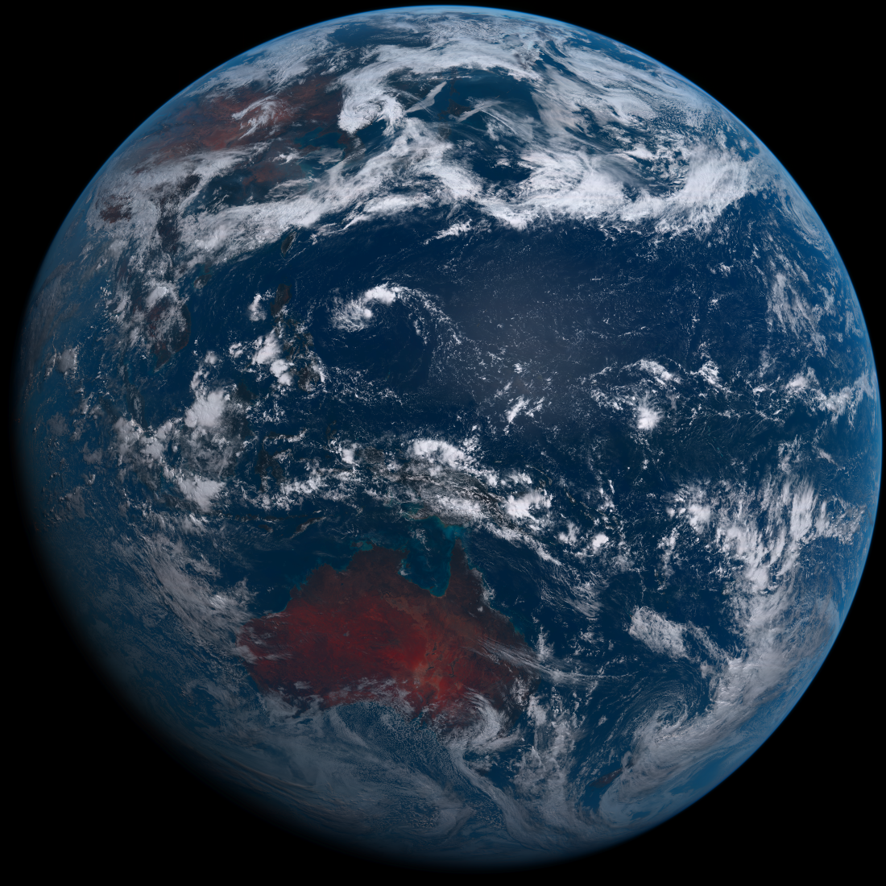
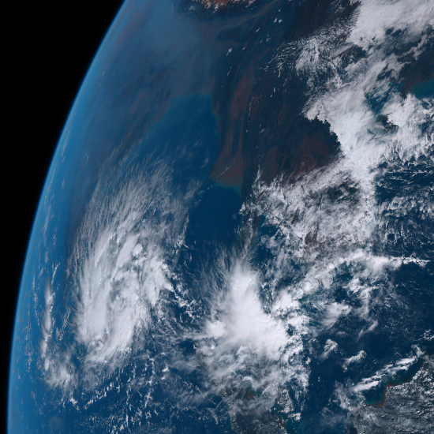

# himawari


[](https://codeclimate.com/github/engura/himawari)
[](https://inch-ci.org/github/engura/himawari)
[](https://app.circleci.com/pipelines/github/engura/himawari)

[](https://rubygems.org/gems/himawari)
[](https://rubygems.org/gems/himawari)


[](https://opensource.org/licenses/MIT)

<details>
 <summary>TOC</summary>

- [about](#himawari)
- [installing](#installation)
- [using](#usage)
- [todo](#todo)
- [development](#development)
- [contributing](#contributing)
- [license](#license)
</details>

Access images from the [himawari8 weather satellite](https://himawari8.nict.go.jp)] (courtesy of NICT) and compose near real-time desktop backgrounds of Earth or use the high-res images for other personal uses. For example....



# Installation
Add this line to your application's Gemfile:
```
gem 'himawari'
```
And then execute:
```
bundle
```
Or install it yourself as:
```
gem install himawari
```
## Install CLI Dependencies
Mac/Linux: run `bin/setup`
On other systems, please try to install `imagemagick` and `parallel` utilities manually...
https://linux.die.net/man/1/parallel
https://github.com/minimagick/minimagick

# Usage

You can use it as a stand alone CLI executable, or as a Library.

*RUN EXAMPLE*: `himawari -w /home/User/himawari -d /home/User/Pictures/live -r 4 -f top -m day -v`

To set cron (with all the supplied arguments):
`himawari -w /home/User/himawari -d /home/User/Pictures/live -r 4 -f top -m day -v -c set`
and then to remove it from cron (please note the arguments must be the same as the ones used during `cron set`-ting, otherwise it won't be removed):
`himawari -w /home/User/himawari -d /home/User/Pictures/live -r 4 -f top -m day -v -c clear`

### Details
 - Grabs a tiled image from Himawari, (each photo of Earth is split into square tiles of 550x550px) reassembles it into one image, and optionally copies one of the downloaded images into a `destination` folder to use as a desktop background.

 - Can change the resolution. Default is "2", smallest. Maximum is "20". It will produce an jpg of ~200MB in size for the full planet. The allowed steps are [2, 4, 8, 16, 20]. Resolution of 2 means that the image is composed of *2* tiles across, so the full image becomes 1100px wide/high. An image of resolution *factor 4* is then 550 * 4 = 2200px across. And the maximum one is 20 * 550 = 11000px X 11000px!!!!!
 - Since the images can be kinda big, we can customize which part of the planet we want to see: `top`, `full` planet, or bottom (`low`).
 - When using the `autorun` option (it's the method that command line utility uses), we save the last 48hrs in a folder (`workdir`). We can then have 2 options: either show what is `now` outside, or! cycle the last complete 24 hours with a new background photo every 2 minutes? Because the images are all downloaded at once, and then an incremental download of one photo as needed, the internet traffic is relatively reasonable. Cycling the background photos doesn't need to access internet or download anything.
 - An easy way to use the script: set the `himawari` into cron with whatever arguments you want it to use, and it will automatically update the photos in the destination folder every 2 minutes. Then, just use the OS's Desktop Settings to do a "desktop slideshow" using pictures in the `destination` folder.
 - Another way to use it can be: download whichever images you like into the `workdir`, and set the System's Desktop Settings to do a slideshow desktop background from there. The tricky part here is that the OS does not always pick up new images that are downloaded into the `workdir` right away. (maybe until a restart or something.) Also, the slideshows are randomized by default, so the picture of the planet could be jumping to random time stamps.

 - 1. do NOT attempt to fetch data from black listed WiFis
 - 2. if no internet, just show last available data
 - 3. keep only 1 day's worth of images (~144 photos)
 - 4. check for `No Image` images and skip those (until? if? --so far, I haven't noticed that they ever get changed) they become available. (There are tricky tiles that are literally just black squares with the words "No Image" written on them. They probably happen due to the Sun being in the camera's view. Or maybe because of Aliens. Or evil Government cover ups? Either way, these tiles are not useful to us, and are skipped.)
 

### Full list of arguments for the command line
`himawari -h`
- `-f, --focus STRING` Which section of the planet to focus on? Valid values are `full`, `top`, `mid`, `low`. Default is `top`. The script takes a common monitor's aspect ratio (16x9) and does its best to keep the cropped image as close to that AR as possible. It will not, however, crop off parts of the downloaded tiles, so the final image usually ends up with a wider (more squarish) aspect ratio than 16x9. (But never narrower.)
- `-m, --mode STRING` Valid values are `day` (cycles pics to the `destination` folder from the most recent day) or `live` (copies the latest photo downloaded to `destination`) Default is `day`. Right now, it is hard-coded to switch the photo each 2 minutes in the `destination` folder. With 144 photos to choose from in a 24 hour period, this ends up cycling the view of the planet 5 times each day. 
- `-r, --resolution INT` Adjust the resolution factor of the downloaded image. Valid numbers are 2, 4, 8, 16, 20. 20 is the highest resolution and 2 is the default. For a 4k-monitor a setting of 4 seems sufficient.
- `-d, --destination PATH` The folder where to copy a background image. If left blank, images will just be downloaded to `workdir`.
- `-w, --workdir PATH` The folder where to save all the downloaded pics. If left blank, images will be saved to the `./data` directory relative to your current path.(pwd)
- `-b, --blacklist STRING,STRING...` Blacklist SSIDs of networks from which we do not want to go online to download new images.
- `-c, --cron STRING` Can `set`/`clear` cron with the specified params, so we can update/download the images automatically
- `-v, --verbose` Increase verbosity: mostly for debugging
- `-s, --schedule` Flag for determining when the script is run by schedule/automatically. Don't worry about this one, it is set automatically when the script is added to cron.

### Usage as a library
```
require 'himawari'

# there are basically 2 useful methods exposed to play around with.
# To get 1 picture closest to the provided timestamp:
Himawari.get_pic(datetime: timestamp, workdir: '/home/user/himawari_pics')

# And to get a bunch of pics between 2 date-times:
params = { from: timestamp1, to: timestamp2, workdir: workdir }
Himawari.get_pics(params)
```
- `timestamp` can be either a string (like '2020-06-01 12:30') or a `Time` object.
- pretty much all of the `params` are optional and will be filled in with some defaults (same as the ones mentioned above) if left blank.
- the timestamps' defaults are set like this: `round_down_to_nearest_10_minute_mark(now - 10.minutes)`. So, if it is `2020-12-01 14:19` right now, default timestamp would be `2020-12-01 14:00`)
- these methods return `true` on success, `false` on failure.
- Feel free to check out some other usages in the `./specs`

# TODO
- improve documentation
- add [Windows support](https://github.com/engura/himawari/issues/1)?

# Development
After checking out the repo, doing the steps in `installation` above and messing around with the code, run `rake test` and `rubocop` to use the tests and make sure everything is ok. To run a specific test, use `rake test TEST=spec/test_base.rb TESTOPTS="--name=test_bad_params --seed=1234"` and as for rubocop: `rubocop lib/himawari/base.rb`

## Building the gem on local machine/from source
navigate to the gem's directory and...
Manually:
```
gem build himawari.gemspec
gem install himawari-#.#.#.gem # replace the # with the most recent version
```
Semi-manually (the end result is same as above):
```
bundle exec rake install
```

## Releasing a new version of the Gem
 - Update the version number in `himawari.gemspec`
 - run `bundle exec rake release`, which will create a git tag for the version, push git commits and tags, and push the .gem file to [rubygems.org](https://rubygems.org).

# Contributing
Bug reports and pull requests are welcome on GitHub at https://github.com/engura/himawari.

# License
The gem is available as open source under the terms of the [MIT License](https://opensource.org/licenses/MIT).
